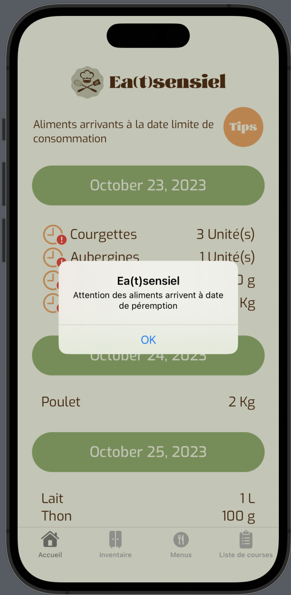
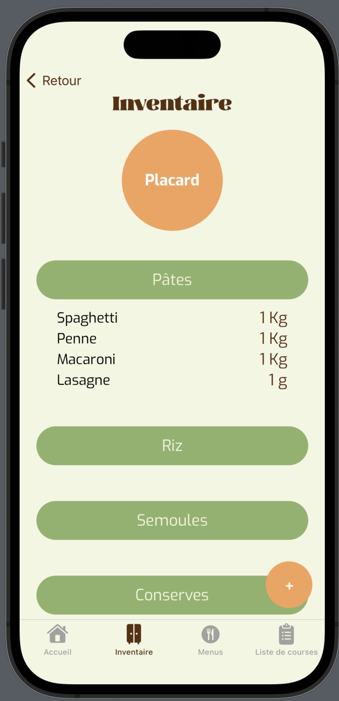
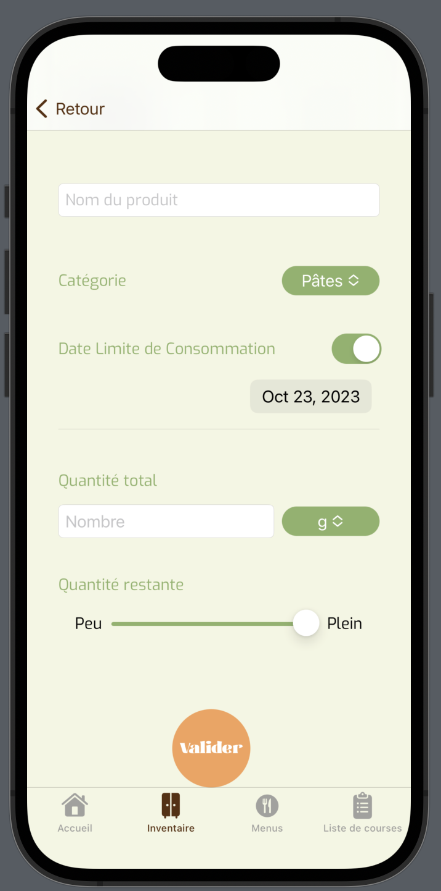
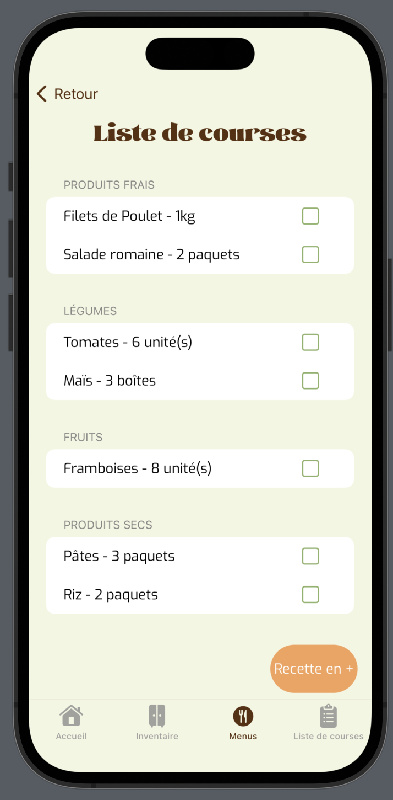

# Eatsensiel

Rien n'est à jeter, tout est à compos(t)er

## Projet

Eatsensiel est une application mobile native iOS qui propose une solution contre le gaspillage alimentaire.
Cette application est le résultat d'un projet d'école réalisé en 8 jours (idée, étude de marché, framework, backlog, maquettage et développement)

### Contexte

En France, 10 million de tonnes de produit destinés à la consommation sont perdus.  Cela représente 16 milliards d'euros par an de perte alimentaire et cela représente 20 kg en moyenne jeté par an et par français. 
Nous avons questionné la population sur les raisons qui poussent les gens à jeter des denrées alimentaires, et nous avons constaté que cela était dû à plusieurs raisons : le manque d'idées de recettes, le manque de temps, de matériel, de motivation et d'organisation.

### Les solutions apportées

- Faire l'inventaire de son frigo
- Indiquer les quantités et les DLC (date limite de consommation)
- Choix de menus proposés sur l'application
- Générer une liste de courses

## Fonctionalités

### Tabbar

- Page d'accueil : calendrier des produits arrivant à péremption.
- Inventaire : permet de visualiser ce qu'il y a actuellement dans nos placacards, notre frigo et congélateur.
- Menus : page permettant de trouver des recettes faciles à partir de ce qu'on a dans son frigo, sélectionner la quantité que l'on veut faire par menu, les sélectionner et gnérer une liste de courses en fonction de ce qu'il manque dans notre inventaire.
- Liste de courses : affiche la liste de cours générée. Possibilité de rajouter des éléments dans la liste.

### Exemple de pages

  

  

 
